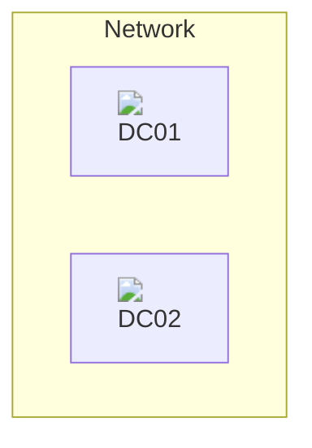

# CloudMigrationHU

## Authors

- [attilamacskasy](https://github.com/attilamacskasy)
- [peterkarpati0](https://github.com/peterkarpati0)

## Purpose

The **CloudMigrationHU** project aims to automate the setup and configuration of Windows Server 2022 domain controllers, specifically DC01 and DC02. The project provides PowerShell scripts to streamline tasks such as setting computer names, configuring IP addresses, and applying common server settings, ensuring a consistent and efficient deployment process.

## Architecture Diagram

