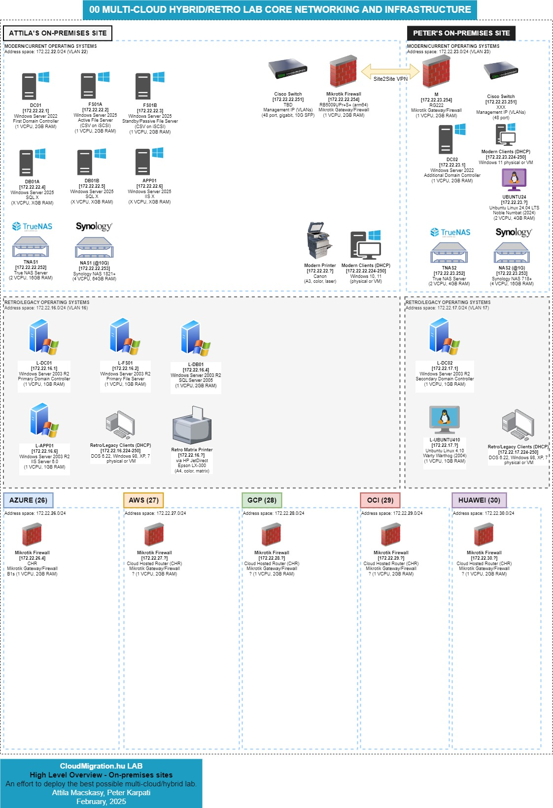
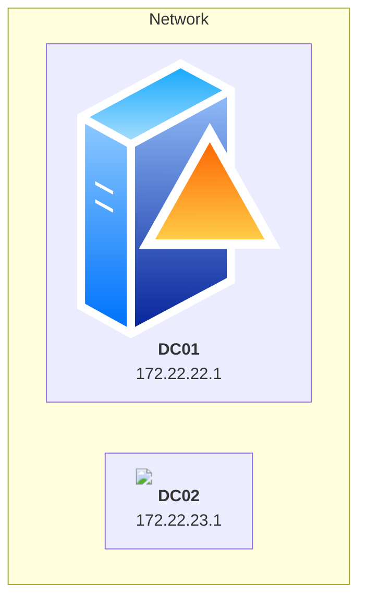

# Cloudmigration.hu - effort to deploy the best possible multi-cloud/hybrid lab

## Purpose

Our mission at CloudMigration.hu LAB is to establish a state-of-the-art, enterprise-inspired multi-site laboratory that leverages Microsoft's best practices for on-premises setups and the Cloud Adoption Framework for cloud environments.

Our lab serves as a comprehensive showcase of the vast expertise accumulated throughout my career, featuring everything from retro computing systems running DOS 6.22, Windows 98, XP, 7, up to the latest Windows 11.

On the server side, we've implemented essential infrastructure components including domain controllers, databases, file servers, application servers, with added redundancy in NAS, and uniform appliance-based gateways across on-premises and cloud platforms.

Our cloud strategy extends to major hyperscalers like Azure, AWS, and GCP, embracing multi-cloud networking and identity synchronization alongside hybrid designs. We love DevOps, aiming to automate as much as possible to provide a practical learning environment.

The lab utilizes virtualization technologies from VMware and Hyper-V, runs VMs on Synology NAS, and explores containerization and Kubernetes clusters.

This lab is designed to demonstrate effective cloud migration and modernization strategies, from VMs to Kubernetes, including database migrations. Join us on this exciting journey; stay updated and learn with us at cloudmigration.blog.

## Authors

- 
  
  
- 
  

## The technologies we follow - subnet details for 172.22.22.0/24 (split into /27)

Below is how we allocate various technologies within a single /24 network. Each technology stack is assigned a /27 subnet, providing 30 usable IP addresses per segment.
This table provides a breakdown of the 172.22.22.0/24 network, divided into smaller /27 subnets.

Consider this an advanced source system for any migration and modernization tasks, whether from on-premises to the cloud or between cloud environments.

Our primary focus is on **networking and security**, with a commitment to mastering **Kubernetes’ pluggable networking architecture**, including [Project Calico](https://www.tigera.io/tigera-products/calico/).  

However, this journey is extensive—starting from mounting Windows 2003 servers on DOS 6.22 to power our retro gaming LAN party because sometimes, even cloud engineers need a break.

| Technology            | Subnet             | Netmask            | Network Address   | Usable IPs | First Usable IP  | Last Usable IP   | Broadcast Address  |
|:----------------------|:------------------|:-------------------|:------------------|-----------:|:-----------------|:-----------------|:-------------------|
| SHARED INFRA         | 172.22.22.0/27     | 255.255.255.224    | 172.22.22.0       |         30 | 172.22.22.1      | 172.22.22.30     | 172.22.22.31       |
| VMWARE VSPHERE       | 172.22.22.32/27    | 255.255.255.224    | 172.22.22.32      |         30 | 172.22.22.33     | 172.22.22.62     | 172.22.22.63       |
| MICROSOFT HYPER-V    | 172.22.22.64/27    | 255.255.255.224    | 172.22.22.64      |         30 | 172.22.22.65     | 172.22.22.94     | 172.22.22.95       |
| RED HAT             | 172.22.22.96/27    | 255.255.255.224    | 172.22.22.96      |         30 | 172.22.22.97     | 172.22.22.126    | 172.22.22.127      |
| OPEN SOURCE VIRT    | 172.22.22.128/27   | 255.255.255.224    | 172.22.22.128     |         30 | 172.22.22.129    | 172.22.22.158    | 172.22.22.159      |
| CONTAINERS          | 172.22.22.160/27   | 255.255.255.224    | 172.22.22.160     |         30 | 172.22.22.161    | 172.22.22.190    | 172.22.22.191      |
| KUBERNETES          | 172.22.22.192/27   | 255.255.255.224    | 172.22.22.192     |         30 | 172.22.22.193    | 172.22.22.222    | 172.22.22.223      |
| CLIENTS (DHCP) & NAS | 172.22.22.224/27   | 255.255.255.224    | 172.22.22.224     |         30 | 172.22.22.225    | 172.22.22.254    | 172.22.22.255      |

## Architecture Diagram v1

## Testing Mermaid (Peter)

We chose to use draw.io instead of Mermaid. However, with the integration of AI into our workflow, we hope that AI will eventually be able to generate diagrams as polished as the ones we create.

| Feature                   | **Mermaid**                     | **draw.io**                     |
|---------------------------|----------------------------------|----------------------------------|
| **Creation Method**       | Text-based (code)               | Graphical (drag-and-drop)       |
| **Integration in Markdown**| Inline with `mermaid` code block| Embed exported image or link     |
| **Ease of Use**           | Requires learning syntax         | Intuitive, WYSIWYG              |
| **Version Control**       | Excellent (text-based)           | Limited (binary files)          |
| **Complex Diagrams**      | Limited for very detailed designs| Handles complex diagrams easily |
| **Dependencies**          | Markdown viewer with Mermaid support| External draw.io tool required  |
| **Dynamic Editing**       | Editable within Markdown file    | Requires re-exporting           |

