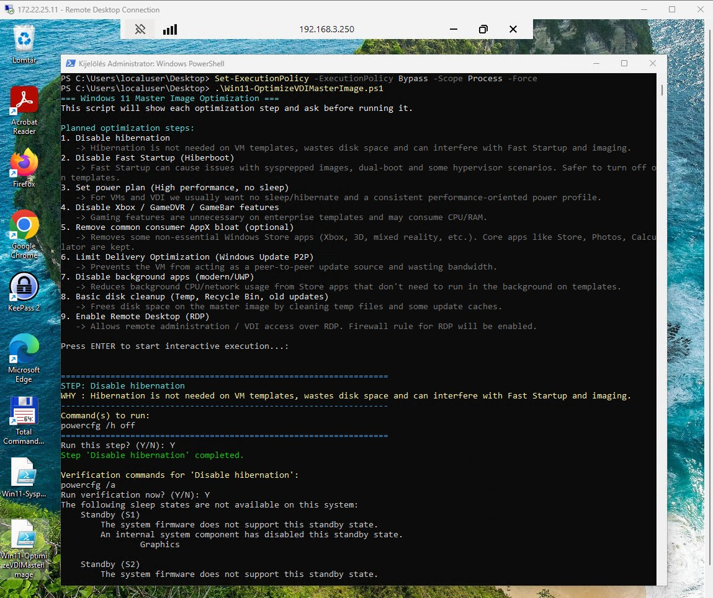

# Windows 11 Master Image Optimization Script

This folder contains `Win11-OptimizeVDIMasterImage.ps1`, an **interactive optimization script** for preparing a Windows 11 master image (golden image) before Sysprep and templating (for VDI, Proxmox, Hyper-V, etc.).

The script walks through a **series of safe OS-level optimizations**, shows you *exactly* what it will run, explains *why* it matters, and asks for confirmation (or lets you choose **A = all**) before executing anything.

The screenshots below show the interactive flow as it runs step-by-step in an elevated PowerShell window.




---

## Why this script is important

When you build a Windows 11 **master image** that will be cloned many times (VDI pools, lab templates, Proxmox templates, etc.), you want:

- Predictable power behavior (no random sleep / hibernate)
- No consumer/gaming cruft running in the background
- Reduced update / bandwidth noise
- Cleaned-up disk to keep the base image small
- RDP ready for remote administration or VDI access

Doing all of this **by hand** on each image is error-prone. This script:

- Centralizes the hardening/optimization steps in one place
- Shows you what it will do and *why*
- Lets you run all steps in one shot (**A for All**) or cherry-pick
- Is safe to re-run on the same VM (idempotent-ish settings)

Run it **after you’ve installed drivers, updates, and core apps** but **before** you Sysprep and capture/convert the machine to a template.

---

## How to run

1. Open **PowerShell as Administrator** in the folder where the script is located (or copy it to the desktop of the VM).
2. Temporarily relax execution policy for this session:
   ```powershell
   Set-ExecutionPolicy -ExecutionPolicy Bypass -Scope Process -Force
   ```
3. Start the script:
   ```powershell
   .\Win11-OptimizeVDIMasterImage.ps1
   ```
4. You will see a list of planned steps, then each step will be shown with:
   - `STEP: <name>`
   - `WHY : <explanation>`
   - The exact PowerShell commands that will be executed
5. For each step you can answer:
   - `Y` – run this step now
   - `N` – skip this step
   - `A` – run **all remaining steps automatically** without further prompts
6. After a step finishes, you can optionally run the suggested **verification commands**.

---

## What settings the script adjusts

Below is a concise summary of each built-in optimization.

### 1. Disable hibernation

**Command:**
```powershell
powercfg /h off
```

**Effect:**
- Disables system hibernation and removes `hiberfil.sys` (saving several GB).
- Prevents hibernation/Fast Startup side effects on virtual machines and images.

### 2. Disable Fast Startup (Hiberboot)

**Command:**
```powershell
Set-ItemProperty -Path 'HKLM:\SYSTEM\CurrentControlSet\Control\Session Manager\Power' -Name HiberbootEnabled -Value 0 -Type DWord
```

**Effect:**
- Turns off Windows Fast Startup.
- Avoids issues with Sysprep, dual-boot scenarios, and some hypervisors where partial hibernation state can confuse the VM.

### 3. Set power plan: High performance, no sleep

**Command (simplified):**
```powershell
$highPerf = powercfg -l | Select-String "High performance"
if ($highPerf) {
    $guid = ($highPerf.ToString().Split()[3]).Trim()
    powercfg -setactive $guid
}
powercfg -change -monitor-timeout-ac 0
powercfg -change -standby-timeout-ac 0
powercfg -change -hibernate-timeout-ac 0
```

**Effect:**
- Activates the **High performance** power plan when available.
- Disables display sleep, standby, and hibernate timers on AC power.
- Keeps VMs and VDI sessions responsive and avoids them going to sleep.

### 4. Disable Xbox / GameDVR / GameBar features

**Commands (simplified):**
```powershell
New-Item -Path 'HKLM:\SOFTWARE\Policies\Microsoft\Windows' -Name 'GameDVR' -Force | Out-Null
Set-ItemProperty -Path 'HKLM:\SOFTWARE\Policies\Microsoft\Windows\GameDVR' -Name 'AllowGameDVR' -Type DWord -Value 0

New-Item -Path 'HKLM:\SOFTWARE\Policies\Microsoft\Windows' -Name 'GameBar' -Force | Out-Null
Set-ItemProperty -Path 'HKLM:\SOFTWARE\Policies\Microsoft\Windows\GameBar' -Name 'AllowGameBar' -Type DWord -Value 0
```

**Effect:**
- Disables Game DVR and Game Bar policies.
- Reduces unnecessary gaming-related background activity on enterprise images.

### 5. Remove common consumer AppX bloat (optional)

**Commands (simplified):**
```powershell
$patterns = @(
  "Microsoft.Xbox*", "Microsoft.GamingApp*", "Microsoft.ZuneMusic*",
  "Microsoft.ZuneVideo*", "Microsoft.Microsoft3DViewer*", "Microsoft.MSPaint*",
  "Microsoft.Print3D*", "Microsoft.MixedReality.Portal*", "Microsoft.SkypeApp*",
  "Microsoft.GetHelp*", "Microsoft.Getstarted*", "Microsoft.SolitaireCollection*",
  "Microsoft.People*", "Microsoft.BingWeather*", "Microsoft.BingNews*"
)

foreach ($p in $patterns) {
  Get-AppxPackage -AllUsers | Where-Object { $_.Name -like $p } | ForEach-Object {
    Remove-AppxPackage -Package $_.PackageFullName -AllUsers -ErrorAction Stop
  }
}
```

With extra logic to **skip protected system apps** (e.g., some Xbox components) where removal is not supported.

**Effect:**
- Uninstalls many non-essential consumer apps from the base image.
- Keeps core functionality (Store, Photos, Calculator, etc.) while reducing clutter.
- Slightly lowers update/fail rates and background activity from those apps.

### 6. Limit Delivery Optimization (Windows Update P2P)

**Commands:**
```powershell
New-Item -Path 'HKLM:\SOFTWARE\Policies\Microsoft\Windows' -Name 'DeliveryOptimization' -Force | Out-Null
Set-ItemProperty -Path 'HKLM:\SOFTWARE\Policies\Microsoft\Windows\DeliveryOptimization' -Name 'DODownloadMode' -Type DWord -Value 0
```

**Effect:**
- Sets Windows Delivery Optimization policy to **0** (simple download mode).
- Prevents the VM from acting as a peer-to-peer update source and chewing up bandwidth.

### 7. Disable background apps (modern/UWP)

**Commands:**
```powershell
New-Item -Path 'HKLM:\SOFTWARE\Policies\Microsoft\Windows' -Name 'AppPrivacy' -Force | Out-Null
Set-ItemProperty -Path 'HKLM:\SOFTWARE\Policies\Microsoft\Windows\AppPrivacy' -Name 'LetAppsRunInBackground' -Type DWord -Value 2
```

**Effect:**
- Policy value `2` blocks modern/UWP apps from running in the background.
- Reduces background CPU, memory, and network activity on VDI/VM templates.

### 8. Basic disk cleanup (Temp, Recycle Bin, old updates)

**Command:**
```powershell
cleanmgr.exe /sagerun:1
```

**Effect:**
- Runs Disk Cleanup with a preconfigured **sageset 1** profile.
- Cleans up temp files, recycle bin, and certain update caches to shrink the image size.
- On first use you may have to define what `sageset 1` includes.

### 9. Enable Remote Desktop (RDP)

**Commands:**
```powershell
Set-ItemProperty -Path 'HKLM:\SYSTEM\CurrentControlSet\Control\Terminal Server' -Name 'fDenyTSConnections' -Value 0
Enable-NetFirewallRule -DisplayGroup 'Remote Desktop' -ErrorAction SilentlyContinue
```

**Effect:**
- Enables RDP connections to the VM.
- Turns on the firewall rules in the **Remote Desktop** group (if present).
- Makes it easier to manage the template over RDP or use it as a VDI image.

---

## When to run this relative to Sysprep

A typical golden-image flow:

1. Install Windows 11, drivers, and required enterprise apps.
2. Run Windows Update until fully patched.
3. Optionally run your own hardening scripts or tools.
4. **Run `Win11-OptimizeVDIMasterImage.ps1`** and accept the steps you want (or `A` for all).
5. Reboot once if prompted or if you changed many system settings.
6. Then run your **Sysprep** / template-preparation script (for example `Win11-SysprepCleanup.ps1` in the other folder).

This ensures your captured template is **clean, lean, and predictable** for all future clones.
