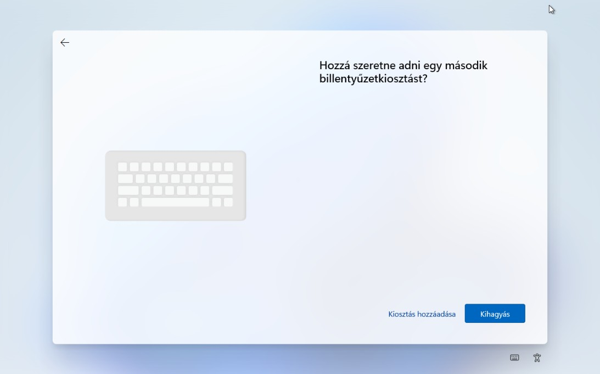
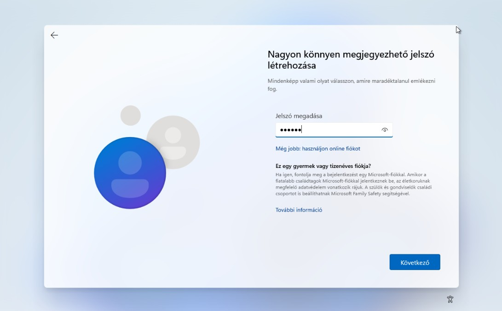
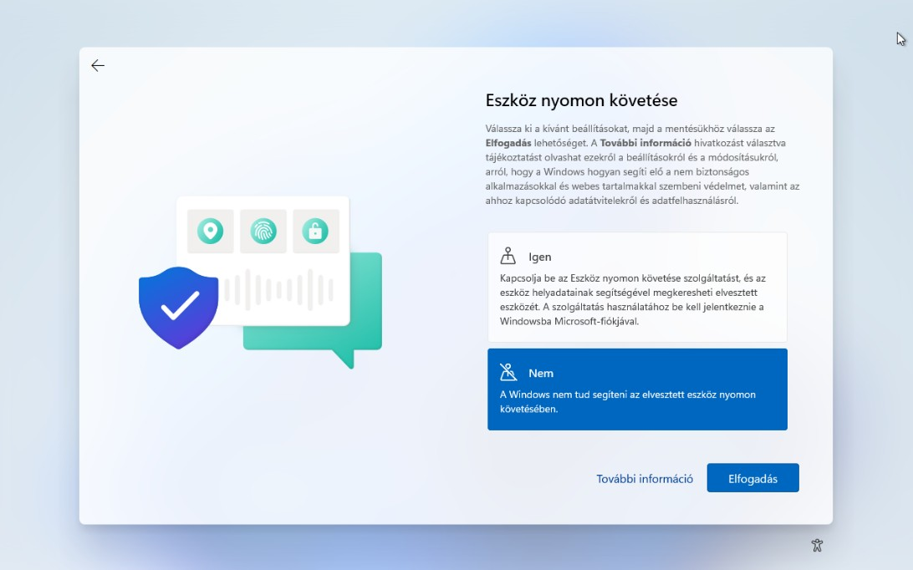

# Unattend.xml Screenshot Mapping Guide

This document explains how the `unattend.xml` file controls each Windows 11 OOBE (Out-of-Box Experience) screen shown in screenshots `unattend.xml-01.jpg` through `unattend.xml-15.jpg`.

When you run:
```powershell
.\Win11-SysprepCleanup.ps1 -CloudbaseAction Enable -RunSysprep -UnattendLanguage hu-HU
# or
.\Win11-SysprepCleanup.ps1 -CloudbaseAction Enable -RunSysprep -UnattendLanguage en-US
```

The script generates `C:\Windows\System32\Sysprep\unattend.xml` and runs:
```
Sysprep.exe /generalize /oobe /shutdown /unattend:C:\Windows\System32\Sysprep\unattend.xml
```

Below, each screenshot is mapped to its corresponding XML configuration.

---

## 01 - Keyboard Layout Selection

### Screenshot


**What the screen shows:** Windows asks "Is this the right keyboard layout or input method?" in Hungarian. The selected layout is **magyar** (Hungarian).

### Relevant XML Component
**Component:** `Microsoft-Windows-International-Core` (oobeSystem pass)

```xml
<settings pass="oobeSystem">
  <component name="Microsoft-Windows-International-Core" processorArchitecture="amd64" 
             publicKeyToken="31bf3856ad364e35" language="neutral" versionScope="nonSxS">
    <InputLocale>hu-HU</InputLocale>
    <SystemLocale>hu-HU</SystemLocale>
    <UILanguage>hu-HU</UILanguage>
    <UILanguageFallback>hu-HU</UILanguageFallback>
    <UserLocale>hu-HU</UserLocale>
  </component>
</settings>
```

**How it works:**
- `InputLocale` = keyboard layout (hu-HU for Hungarian, en-US for English)
- `UILanguage` / `UILanguageFallback` = interface language
- `SystemLocale` / `UserLocale` = regional formats (date, time, currency)
- When these are pre-configured, this screen is **skipped automatically**

---

## 02 - Add Second Keyboard Layout

### Screenshot


**What the screen shows:** "Do you want to add a second keyboard layout?" with options to add or skip.

### Relevant XML Component
Same component as #01: `Microsoft-Windows-International-Core`

```xml
<InputLocale>hu-HU</InputLocale>
```

**How it works:**
- Primary keyboard is already set via `InputLocale`
- This screen is typically **skipped** in unattended setup
- Windows uses only the keyboard defined in XML

---

## 03 - License Agreement (EULA)

### Screenshot


**What the screen shows:** Microsoft Software License Terms in Hungarian with an "Accept" button.

### Relevant XML Component
**Component:** `Microsoft-Windows-Shell-Setup` → `OOBE` (oobeSystem pass)

```xml
<component name="Microsoft-Windows-Shell-Setup" processorArchitecture="amd64" 
           publicKeyToken="31bf3856ad364e35" language="neutral" versionScope="nonSxS">
  <OOBE>
    <HideEULAPage>true</HideEULAPage>
  </OOBE>
</component>
```

**How it works:**
- `HideEULAPage=true` completely **hides** this license agreement screen
- License is automatically accepted in unattended deployment

---

## 04 - Device Name

### Screenshot


**What the screen shows:** "Give your device a name" with a text field (example: `tpl-win-11-v2`).

### Relevant XML Component
**Component:** None (not automated by current unattend.xml)

```xml
<!-- Related but NOT for hostname: -->
<RegisteredOwner>Administrator</RegisteredOwner>
<RegisteredOrganization>Proxmox</RegisteredOrganization>
<TimeZone>UTC</TimeZone>
```

**How it works:**
- Device name is **NOT** set by this unattend.xml
- Must be entered manually during OOBE or set by later automation (cloud-init)
- The XML above sets owner/org/timezone metadata only

---

## 05 - Setup Type (Personal vs Work/School)

### Screenshot


**What the screen shows:** "How would you like to set up this device?" with options for personal use or work/school use.

### Relevant XML Component
**Component:** `Microsoft-Windows-Shell-Setup` → `OOBE` (oobeSystem pass)

```xml
<OOBE>
  <HideOnlineAccountScreens>true</HideOnlineAccountScreens>
  <NetworkLocation>Work</NetworkLocation>
  <SkipUserOOBE>true</SkipUserOOBE>
  <SkipMachineOOBE>true</SkipMachineOOBE>
</OOBE>
```

**How it works:**
- `HideOnlineAccountScreens=true` prevents Microsoft account prompts
- `NetworkLocation=Work` sets network profile to Work (enterprise)
- `SkipUserOOBE` + `SkipMachineOOBE` **skip this entire wizard**
- Screen is not shown in unattended setup

---

## 06 - Local Account Username

### Screenshot


**What the screen shows:** "Who will use this device?" asking for a username (example: `localuser`).

### Relevant XML Component
**Component:** `Microsoft-Windows-Shell-Setup` → `OOBE` (oobeSystem pass)

```xml
<OOBE>
  <SkipUserOOBE>true</SkipUserOOBE>
</OOBE>
```

**How it works:**
- `SkipUserOOBE=true` **skips all user account creation screens**
- No username/password is set in the XML
- Accounts are created later by automation (cloudbase-init) or manually

---

## 07 - Local Account Password

### Screenshot


**What the screen shows:** "Create an easy-to-remember password" with a password input field.

### Relevant XML Component
**Component:** `Microsoft-Windows-Shell-Setup` → `OOBE` (oobeSystem pass)

```xml
<OOBE>
  <SkipUserOOBE>true</SkipUserOOBE>
</OOBE>
```

**How it works:**
- Part of user OOBE; **skipped** by `SkipUserOOBE=true`
- Password is set later via automation or manually

---

## 08 - Security Questions

### Screenshot


**What the screen shows:** "Now, provide security questions" for password recovery (example: first pet's name).

### Relevant XML Component
**Component:** `Microsoft-Windows-Shell-Setup` → `OOBE` (oobeSystem pass)

```xml
<OOBE>
  <SkipUserOOBE>true</SkipUserOOBE>
</OOBE>
```

**How it works:**
- Security questions are part of user OOBE
- **Skipped** when `SkipUserOOBE=true`

---

## 09 - Privacy: Location Services

### Screenshot


**What the screen shows:** "Allow location services for Microsoft and apps?" with Yes/No options (No selected).

### Relevant XML Component
**Component:** `Microsoft-Windows-Shell-Setup` → `OOBE` (oobeSystem pass)

```xml
<OOBE>
  <ProtectYourPC>1</ProtectYourPC>
  <SkipUserOOBE>true</SkipUserOOBE>
</OOBE>
```

**How it works:**
- `ProtectYourPC=1` sets privacy/security baseline
- `SkipUserOOBE=true` **skips this privacy screen**
- Default privacy settings are applied automatically

---

## 10 - Privacy: Find My Device

### Screenshot


**What the screen shows:** "Track my device" (Find my device) with Yes/No options (No selected).

### Relevant XML Component
**Component:** `Microsoft-Windows-Shell-Setup` → `OOBE` (oobeSystem pass)

```xml
<OOBE>
  <HideOnlineAccountScreens>true</HideOnlineAccountScreens>
  <SkipUserOOBE>true</SkipUserOOBE>
</OOBE>
```

**How it works:**
- Find my device requires Microsoft account
- `HideOnlineAccountScreens=true` hides Microsoft account features
- `SkipUserOOBE=true` **skips this screen**

---

## 11 - Privacy: Diagnostic Data

### Screenshot


**What the screen shows:** "Send diagnostic data to Microsoft" with options for required or full diagnostics (required selected).

### Relevant XML Component
**Component:** `Microsoft-Windows-Shell-Setup` → `OOBE` (oobeSystem pass)

```xml
<OOBE>
  <ProtectYourPC>1</ProtectYourPC>
</OOBE>
```

**How it works:**
- `ProtectYourPC=1` sets diagnostic level (1 = required only)
- Screen is **skipped**; setting is applied automatically

---

## 12 - Privacy: Inking & Typing

### Screenshot


**What the screen shows:** "Improve inking & typing" asking to send optional diagnostic data (No selected).

### Relevant XML Component
**Component:** `Microsoft-Windows-Shell-Setup` → `OOBE` (oobeSystem pass)

```xml
<OOBE>
  <ProtectYourPC>1</ProtectYourPC>
</OOBE>
```

**How it works:**
- Optional diagnostics controlled by `ProtectYourPC`
- Screen is **skipped** in unattended setup

---

## 13 - Privacy: Tailored Experiences

### Screenshot


**What the screen shows:** "Use diagnostic data for tailored experiences" (tips, ads, recommendations) with No selected.

### Relevant XML Component
**Component:** `Microsoft-Windows-Shell-Setup` → `OOBE` (oobeSystem pass)

```xml
<OOBE>
  <ProtectYourPC>1</ProtectYourPC>
</OOBE>
```

**How it works:**
- Personalized experiences controlled by `ProtectYourPC`
- Screen is **skipped**; non-personalized mode enforced

---

## 14 - Reserved for Additional Documentation

### Screenshot


*Reserved for documenting additional OOBE screens or post-setup configuration screens you want to add later.*

### Relevant XML Component
To be determined based on the screen content.

---

## 15 - Reserved for Additional Documentation

### Screenshot


*Reserved for documenting activation status, first desktop after OOBE, or other post-Sysprep screens.*

### Relevant XML Component

**For activation/rearm:**
```xml
<settings pass="generalize">
  <component name="Microsoft-Windows-Security-SPP" processorArchitecture="amd64" 
             publicKeyToken="31bf3856ad364e35" language="neutral" versionScope="nonSxS">
    <SkipRearm>1</SkipRearm>
  </component>
</settings>
```

**How it works:**
- `SkipRearm=1` prevents Windows from consuming an activation rearm during Sysprep
- Useful for template images that will be generalized multiple times

---

## Complete XML Structure Reference

The full `unattend.xml` generated by the script combines all the components shown above:

```xml
<?xml version="1.0" encoding="utf-8"?>
<unattend xmlns="urn:schemas-microsoft-com:unattend">

  <settings pass="oobeSystem">
    <!-- Language & Keyboard (Screenshots 01-02) -->
    <component name="Microsoft-Windows-International-Core" processorArchitecture="amd64" 
               publicKeyToken="31bf3856ad364e35" language="neutral" versionScope="nonSxS">
      <InputLocale>hu-HU</InputLocale>
      <SystemLocale>hu-HU</SystemLocale>
      <UILanguage>hu-HU</UILanguage>
      <UILanguageFallback>hu-HU</UILanguageFallback>
      <UserLocale>hu-HU</UserLocale>
    </component>

    <!-- OOBE Settings (Screenshots 03-13) -->
    <component name="Microsoft-Windows-Shell-Setup" processorArchitecture="amd64" 
               publicKeyToken="31bf3856ad364e35" language="neutral" versionScope="nonSxS">
      <OOBE>
        <HideEULAPage>true</HideEULAPage>
        <HideOEMRegistrationScreen>true</HideOEMRegistrationScreen>
        <HideOnlineAccountScreens>true</HideOnlineAccountScreens>
        <HideWirelessSetupInOOBE>true</HideWirelessSetupInOOBE>
        <NetworkLocation>Work</NetworkLocation>
        <ProtectYourPC>1</ProtectYourPC>
        <SkipUserOOBE>true</SkipUserOOBE>
        <SkipMachineOOBE>true</SkipMachineOOBE>
      </OOBE>
      <RegisteredOwner>Administrator</RegisteredOwner>
      <RegisteredOrganization>Proxmox</RegisteredOrganization>
      <TimeZone>UTC</TimeZone>
    </component>
  </settings>

  <!-- Activation Settings (Screenshot 15 - if documented) -->
  <settings pass="generalize">
    <component name="Microsoft-Windows-Security-SPP" processorArchitecture="amd64" 
               publicKeyToken="31bf3856ad364e35" language="neutral" versionScope="nonSxS">
      <SkipRearm>1</SkipRearm>
    </component>
  </settings>

</unattend>
```

---

## Summary by Screenshot Category

| Screenshots | Purpose | Primary XML Control |
|------------|---------|-------------------|
| 01-02 | Language & Keyboard | `Microsoft-Windows-International-Core` |
| 03 | License Agreement | `HideEULAPage` |
| 04 | Device Name | Not automated (manual or cloud-init) |
| 05-08 | Account Setup | `SkipUserOOBE`, `SkipMachineOOBE` |
| 09-13 | Privacy Settings | `ProtectYourPC`, `SkipUserOOBE` |
| 14-15 | Reserved | To be documented |

This mapping shows how `unattend.xml` automates or skips each Windows 11 OOBE screen for Proxmox template creation.
