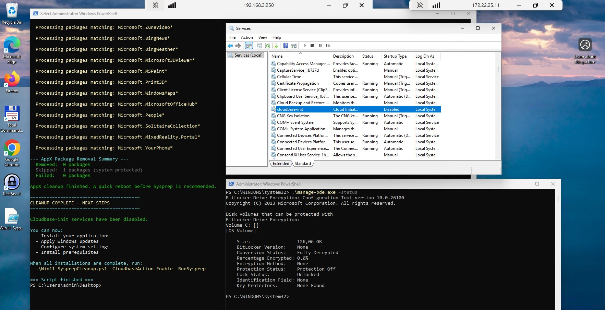

# Win11-SysprepCleanup.ps1 - Quick Reference

## 🎯 Purpose
Prepare Windows 11 VMs for Proxmox template creation by handling cloudbase-init and removing Sysprep-blocking packages.

## 🚀 Usage

### Check Service Status
```powershell
.\Win11-SysprepCleanup.ps1 -CloudbaseAction Check
```

### Phase 1: Before Installing Apps
```powershell
.\Win11-SysprepCleanup.ps1 -CloudbaseAction Disable
```
**Result:** Cloudbase-init disabled → Safe to install applications

### Phase 2: After Apps Installed (Final Preparation)
```powershell
.\Win11-SysprepCleanup.ps1 -CloudbaseAction Enable -RunSysprep
```
**Result:** 
- Cloudbase-init re-enabled ✅
- BitLocker disabled ✅
- Language packs removed ✅
- User-only packages removed ✅
- AppX blockers cleaned ✅
- Sysprep runs ✅
- VM shuts down ✅

### Manual Sysprep (Without Auto-Run)
```powershell
.\Win11-SysprepCleanup.ps1 -CloudbaseAction Enable
# Then manually run Sysprep when ready
```

## 📋 Parameters

| Parameter | Values | Description |
|-----------|--------|-------------|
| `-CloudbaseAction` | `Check` | Display cloudbase-init service status |
| | `Disable` | Stop and disable cloudbase-init services |
| | `Enable` | Enable cloudbase-init for template deployment |
| `-RunSysprep` | Switch | Run Sysprep after cleanup |
| `-ScanUserPackages` | Switch | Perform deep scan for user-only AppX packages and remove Sysprep blockers (slower, optional) |

## 🔍 What Gets Removed

### Critical Sysprep Blockers
- ✅ **Language Experience Packs** (e.g., `Microsoft.LanguageExperiencePackhu-HU`)
- ✅ User-only installed packages (not provisioned for all users)

### Common Bloatware
- Xbox & Gaming apps
- Bing apps (News, Weather, Finance, Sports)
- Help & Getting Started apps
- Media apps (Zune Music, Zune Video)
- 3D & Mixed Reality apps
- Office Hub
- Maps, People, Your Phone
- Solitaire & other games

### System Apps (Protected - Skipped)
- `Microsoft.XboxGameCallableUI` and other core Windows components

## ✅ Success Indicators

```
✓ Successfully removed
⊘ Skipped: Protected system app
✗ Failed: [error message]
```

## 📊 Output Summary

```
========================================
APPX PACKAGE REMOVAL SUMMARY
========================================
  Removed:  15 packages
  Skipped:  3 packages (system protected)
  Failed:   0 packages

--- Final Verification ---
✓ No user-only packages detected. System is ready for Sysprep!
```

## ⚠️ Important Notes

1. **Always run as Administrator**
2. **Set execution policy first:**
   ```powershell
   Set-ExecutionPolicy -ExecutionPolicy Bypass -Scope Process -Force
   ```
3. **Reboot before Sysprep** (recommended)
4. **Never boot VM after Sysprep** - Convert to template immediately!

## 🐛 Troubleshooting

### If Sysprep Fails
1. Check the log:
   ```powershell
   notepad C:\Windows\System32\Sysprep\Panther\setuperr.log
   ```
2. Run verification:
   ```powershell
   .\Win11-SysprepCleanup.ps1 -CloudbaseAction Check
   ```
3. Re-run the script
4. Reboot and try Sysprep again

### Manual Package Check
```powershell
# List all user-only packages (Sysprep blockers)
$all = Get-AppxPackage -AllUsers
$prov = Get-AppxProvisionedPackage -Online
foreach ($pkg in $all) {
    $match = $prov | Where-Object { $_.DisplayName -eq $pkg.Name }
    if (-not $match) { 
        Write-Host $pkg.Name -ForegroundColor Red 
    }
}
```

## 📂 Script Location
`c:\Users\attila\Desktop\Code\cloudmigrationhu\script\windows-11-sysprep-compatibility-cleanup\`

## 📖 Full Documentation
See `SYSPREP_TROUBLESHOOTING.md` for complete troubleshooting guide.

## 🖼️ Illustrations

These screenshots live next to the script and show typical usage output.

- 
   - Alt: "PowerShell window running Win11-SysprepCleanup.ps1 with cloudbase-init disabled, BitLocker status shown, and AppX Package Removal Summary indicating removed/skipped packages."

- 
   - Alt: "PowerShell window showing final verification with -ScanUserPackages, cleanup complete message, recommended next steps, and Sysprep.exe progress dialog while Sysprep generalizes and shuts down the VM."

---
**Last Updated:** December 5, 2025
