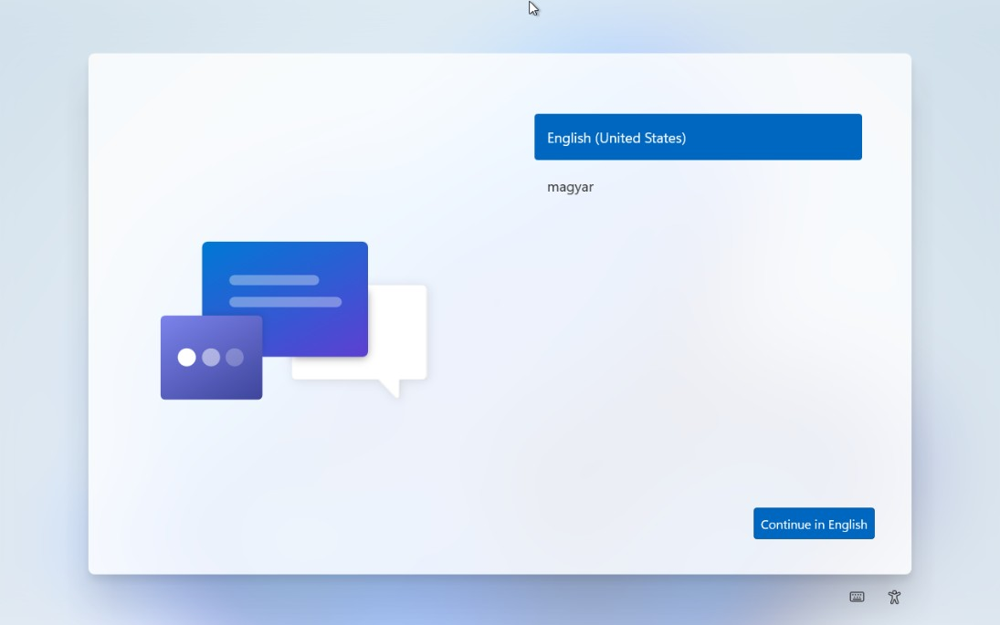
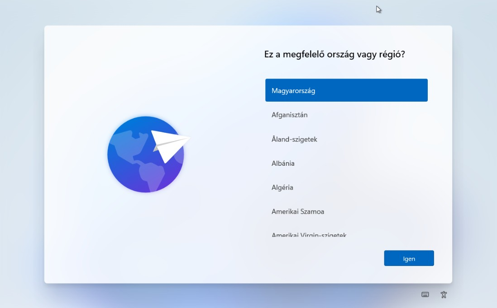
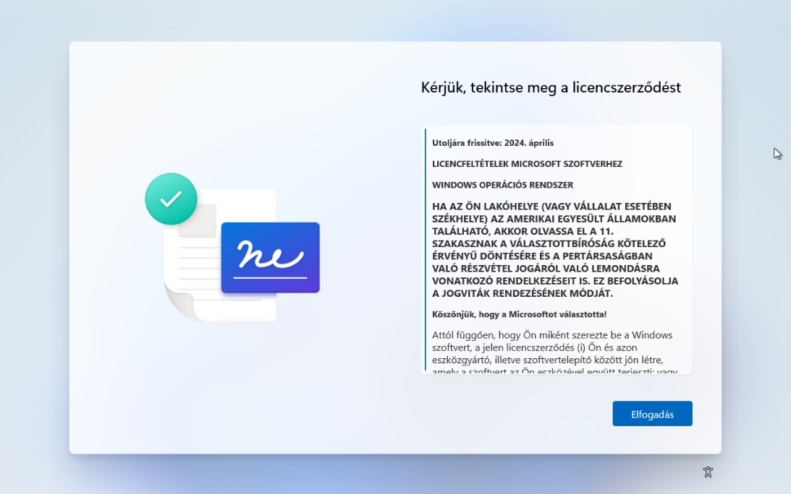
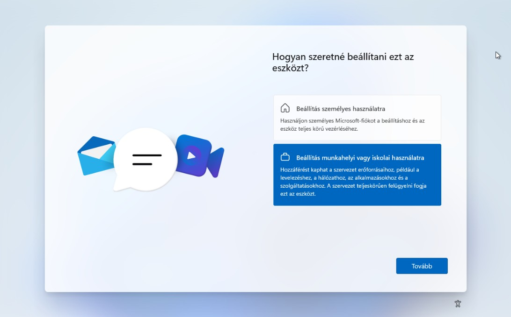
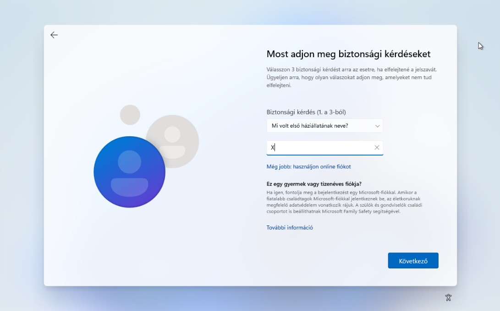

# Unattend.xml and Screenshot Mapping

This document explains how the generated `unattend.xml` file relates to the `unattend.xml-*.jpg` screenshots in this folder. Use it as a visual guide to understand what each XML setting does and how it looks in the manual Windows setup / OOBE process.

The script `Win11-SysprepCleanup.ps1` creates `C:\Windows\System32\Sysprep\unattend.xml` when you run it with `-RunSysprep -UnattendLanguage <en-US|hu-HU>`. The structure of that file is based on the example `unattend.xml` in this folder.

## 1. Language and Region Settings

**Relevant XML component:** `Microsoft-Windows-International-Core` (pass=`oobeSystem`)

```xml
<settings pass="oobeSystem">
  <component name="Microsoft-Windows-International-Core" processorArchitecture="amd64" publicKeyToken="31bf3856ad364e35" language="neutral" versionScope="nonSxS">
    <InputLocale>en-US</InputLocale>
    <SystemLocale>en-US</SystemLocale>
    <UILanguage>en-US</UILanguage>
    <UILanguageFallback>en-US</UILanguageFallback>
    <UserLocale>en-US</UserLocale>
  </component>
</settings>
```

### Screenshot: `unattend.xml-01.jpg`



- **What you see on the image (English):**
  - Windows 11 OOBE screen asking: "Is this the right keyboard layout or input method?" in Hungarian.
  - The first keyboard layout in the list is **Hungarian** (magyar), with other layouts (US, Albanian, etc.) listed below and an **Yes** button to confirm.
- **How XML controls this:**
  - `InputLocale` maps to the primary keyboard layout shown on this page.
  - `SystemLocale` and `UserLocale` control regional formats (date, time, numbers, etc.).
  - `UILanguage` and `UILanguageFallback` control the language of all texts on this screen.
  - When `UnattendLanguage` is `en-US` or `hu-HU`, all five elements are set to that value, so this screen is typically **skipped** and Windows silently uses the language/keyboard you selected in the script.

## 2. OOBE Experience and Privacy / Online Account Screens

**Relevant XML component:** `Microsoft-Windows-Shell-Setup` → `<OOBE>` (pass=`oobeSystem`)

```xml
<component name="Microsoft-Windows-Shell-Setup" processorArchitecture="amd64" publicKeyToken="31bf3856ad364e35" language="neutral" versionScope="nonSxS">
  <OOBE>
    <HideEULAPage>true</HideEULAPage>
    <HideOEMRegistrationScreen>true</HideOEMRegistrationScreen>
    <HideOnlineAccountScreens>true</HideOnlineAccountScreens>
    <HideWirelessSetupInOOBE>true</HideWirelessSetupInOOBE>
    <NetworkLocation>Work</NetworkLocation>
    <ProtectYourPC>1</ProtectYourPC>
    <SkipUserOOBE>true</SkipUserOOBE>
    <SkipMachineOOBE>true</SkipMachineOOBE>
  </OOBE>
  ...
</component>
```

### Screenshot: `unattend.xml-02.jpg`



- **What you see on the image (English):**
  - OOBE screen asking: "Do you want to add a second keyboard layout?" with two buttons: **Add layout** and **Skip**.
- **How XML controls this:**
  - Because the primary layout is already defined by `InputLocale`, Windows can safely skip this follow-up question.
  - In unattended mode, this page is usually not shown; Windows just keeps the layout defined in `InputLocale` and does not prompt for a second one.

## 3. Owner, Organization, and Time Zone

**Relevant XML (same Shell-Setup component):**

```xml
<RegisteredOwner>Administrator</RegisteredOwner>
<RegisteredOrganization>Proxmox</RegisteredOrganization>
<TimeZone>UTC</TimeZone>
```

### Screenshot: `unattend.xml-03.jpg`


- **What you see on the image (English):**
  - License agreement screen in Hungarian asking the user to review and accept the Microsoft Software License Terms.
  - There is an **Accept** button at the bottom of the page.
- **How XML controls this:**
  - `HideEULAPage=true` tells Windows to suppress this entire EULA page during OOBE.
  - With your unattended settings, the license is considered accepted automatically, so this confirmation screen is no longer shown when deploying from the template.

## 4. Activation / Rearm Behavior

**Relevant XML component:** `Microsoft-Windows-Security-SPP` (pass=`generalize`)

```xml
<settings pass="generalize">
  <component name="Microsoft-Windows-Security-SPP" processorArchitecture="amd64" publicKeyToken="31bf3856ad364e35" language="neutral" versionScope="nonSxS">
    <SkipRearm>1</SkipRearm>
  </component>
</settings>
```

### Screenshot: `unattend.xml-04.jpg`


- **What you see on the image (English):**
  - OOBE page titled "Give your device a name" where the user types a computer name (for example `tpl-win-11-v2`).
  - Text below the box explains the length and character rules for the device name.
- **How XML controls this:**
  - This particular screen is **not** directly set by your current `unattend.xml`; the computer name is still provided manually in this template workflow.
  - The closest related XML values are `RegisteredOwner`, `RegisteredOrganization`, and `TimeZone`, which affect system metadata, not the hostname shown here.
  - The screenshot is included to show that some settings (like host name) are still done manually; `unattend.xml` focuses on language, OOBE skipping, and privacy instead.

### Screenshot: `unattend.xml-05.jpg`



- **What you see on the image (English):**
  - OOBE screen asking "How would you like to set up this device?" with two options: **Set up for personal use** and **Set up for work or school**.
- **How XML controls this:**
  - `HideOnlineAccountScreens=true` prevents Windows from forcing you through Microsoft/organization account flows.
  - `SkipUserOOBE=true` and `SkipMachineOOBE=true` tell Windows to skip the entire user and device setup wizard, including this page.
  - `NetworkLocation>Work</NetworkLocation>` aligns the system with a work/enterprise environment, matching the Proxmox template use case.

### Screenshot: `unattend.xml-06.jpg`


- **What you see on the image (English):**
  - OOBE screen titled "Who will use this device?" where the user enters a local account name (for example `localuser`).
- **How XML controls this:**
  - The unattended file does not define a fixed local username or password; instead it skips the whole account-creation flow:

    ```xml
    <SkipUserOOBE>true</SkipUserOOBE>
    ```

  - With `SkipUserOOBE=true`, this page is not displayed during unattended deployments; accounts can be created later by automation (cloudbase-init / Proxmox cloud-init) or administrators.

### Screenshot: `unattend.xml-07.jpg`



- **What you see on the image (English):**
  - OOBE screen prompting to create an "easy to remember" password for the local account, with a password being typed.
- **How XML controls this:**
  - Again controlled by `SkipUserOOBE=true`; the unattended setup skips password-creation screens and lets later automation handle credentials.

### Screenshot: `unattend.xml-08.jpg`


- **What you see on the image (English):**
  - OOBE page asking you to choose and answer security questions (for example "What was the name of your first pet?") for local account recovery.
- **How XML controls this:**
  - This step is also bypassed by `SkipUserOOBE=true`; security questions are never requested during unattended deployment.

### Screenshot: `unattend.xml-09.jpg`


- **What you see on the image (English):**
  - Privacy screen about allowing **location services** for Microsoft and apps. The selected option is **No**, disabling location-based services.
- **How XML controls this:**
  - These privacy choices are part of the broader OOBE privacy flow. In your XML, they are influenced by:

    ```xml
    <ProtectYourPC>1</ProtectYourPC>
    <SkipUserOOBE>true</SkipUserOOBE>
    ```

  - `ProtectYourPC` sets the overall privacy/security baseline.
  - With `SkipUserOOBE`, this page is normally skipped and the location preference is applied automatically instead of being clicked every time.

### Screenshot: `unattend.xml-10.jpg`



- **What you see on the image (English):**
  - Privacy screen titled "Track my device" (Find my device) with **Yes** and **No** options; **No** is selected.
- **How XML controls this:**
  - There is no dedicated `<FindMyDevice>` element in your XML, but this feature depends on online/Microsoft account integration and privacy defaults:

    ```xml
    <HideOnlineAccountScreens>true</HideOnlineAccountScreens>
    <SkipUserOOBE>true</SkipUserOOBE>
    ```

  - Because online-account screens are hidden and user OOBE is skipped, this Find-my-device choice is not presented during unattended setup; the template uses the predefined privacy behavior.

### Screenshot: `unattend.xml-11.jpg`


- **What you see on the image (English):**
  - Privacy screen titled "Send diagnostic data to Microsoft" with options to send only required diagnostics. The minimal/required level is selected.
- **How XML controls this:**
  - The diagnostic level is governed by the same OOBE privacy policy:

    ```xml
    <ProtectYourPC>1</ProtectYourPC>
    ```

  - Combined with `SkipUserOOBE`, this page is skipped and the chosen diagnostic level is applied automatically when deploying from the template.

### Screenshot: `unattend.xml-12.jpg`


- **What you see on the image (English):**
  - Privacy screen titled "Improve inking & typing" asking whether to send optional diagnostic data about handwriting and typing. The **No** option is selected.
- **How XML controls this:**
  - Controlled by the same privacy settings as diagnostics:

    ```xml
    <ProtectYourPC>1</ProtectYourPC>
    ```

  - In unattended deployments, this screen is not shown; Windows uses the predefined privacy level instead.

### Screenshot: `unattend.xml-13.jpg`


- **What you see on the image (English):**
  - Privacy screen about using diagnostic data for **tailored experiences** (tips, ads, and recommendations). The **No** option is selected.
- **How XML controls this:**
  - Still part of the same OOBE privacy and diagnostics group:

    ```xml
    <ProtectYourPC>1</ProtectYourPC>
    ```

  - With `ProtectYourPC` and `SkipUserOOBE`, this tailored-experiences page is skipped and the non-personalized option is applied automatically during unattended setup.

## 5. How the Script Uses This Mapping

When you run:

```powershell
# Hungarian unattended sysprep
.\Win11-SysprepCleanup.ps1 -CloudbaseAction Enable -RunSysprep -UnattendLanguage hu-HU

# English (en-US) unattended sysprep
.\Win11-SysprepCleanup.ps1 -CloudbaseAction Enable -RunSysprep -UnattendLanguage en-US
```

The script:

1. Builds an `unattend.xml` with all the sections shown above.
2. Sets all locale-related values (`InputLocale`, `SystemLocale`, `UILanguage`, `UILanguageFallback`, `UserLocale`) to either `hu-HU` or `en-US`.
3. Writes the file to `C:\Windows\System32\Sysprep\unattend.xml`.
4. Calls:
   - `Sysprep.exe /generalize /oobe /shutdown /unattend:C:\Windows\System32\Sysprep\unattend.xml`

This means the manual steps shown in the screenshots are replaced by:

- Preselected language/region
- Skipped OOBE / privacy / online-account pages
- Predefined owner/organization/time zone
- Controlled activation rearm behavior

Use this document together with the `unattend.xml-*.jpg` files to teach users how each piece of the XML corresponds to something they would otherwise click through manually during setup.
